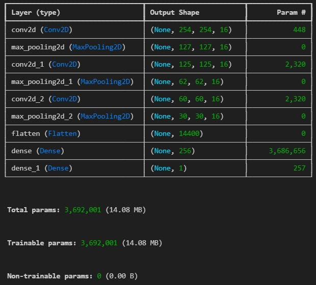
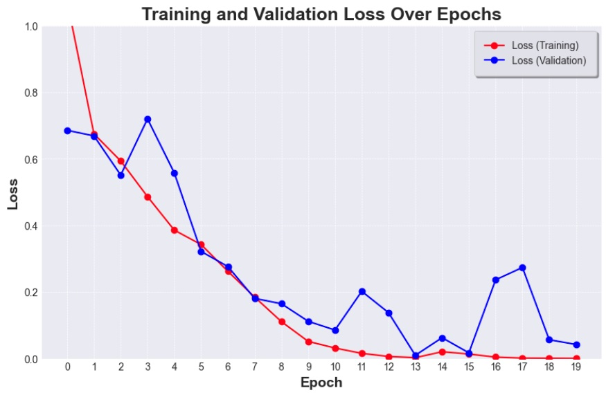
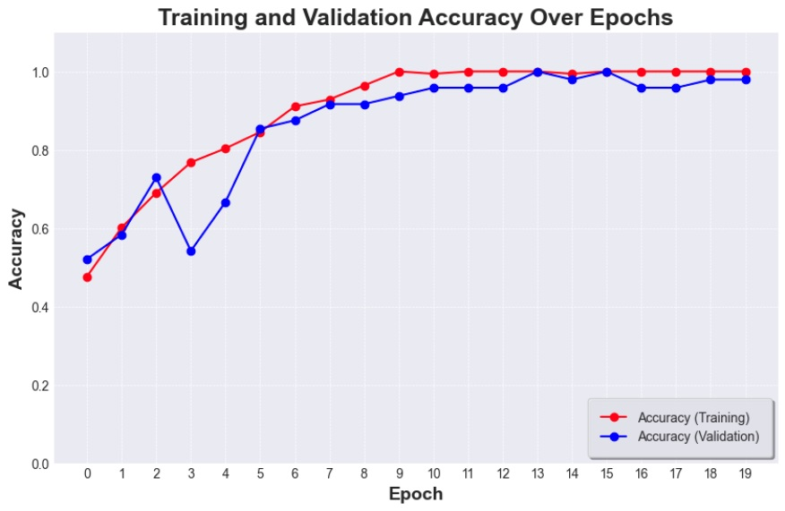
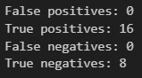

# dogsvshorses
Simple project for binary image classification. Model recognizes either horse or dog in images.

## Overview
Data collected for this project is *not clean*. It was downloaded from google images using browser extension.
- Model summary: 

    
- Loss

    
- Accuracy
    
    
- Evaluation on test batch
    
    

## Guide (Windows 11)

First, clone this repository: 

### 1. Clone this repository
    git clone https://github.com/makspiotrowski02/dogsvshorses.git
    cd dogsvshorses

### 2. Create and activate virtual environment
    python -m venv *env_name*
    *env_name*\Scripts\activate 

### 3. Install libraries
    pip install tensorflow opencv-python Pillow matplotlib numpy keras

### 4. Create data folder
    mkdir data

### 5. Manually unzip dogs and horses and move them to data folder
